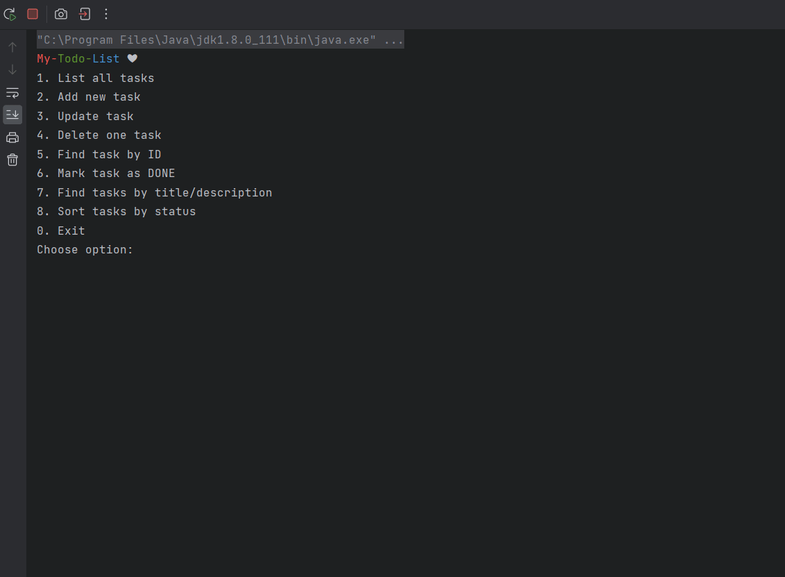

# Todo List 📝

A simple console-based task management application built using Java.  
The app allows users to add, update, delete, and list tasks, persisting them in a JSON file.

## Screenshot  

## Features

- Add new tasks with a title and description
- Update existing tasks
- Delete tasks
- List all tasks
- Persist tasks to a JSON file
- Input validation for safer operations


## Tech Stack
- Java 1.8+
- Standard Java libraries (no external dependencies)
- JSON file for data storage

## Setup Instructions
#### Clone the repository  
Open your Java IDE (IntelliJ, Eclipse, etc.).

In the IDE's terminal, clone the repository:
```sh
git clone https://github.com/Shoshi1766/Todo_List.git
```
Enter the project folder:
```sh
cd Todo_List
```
Run Main.java as a Java Application to start the Todo List.
